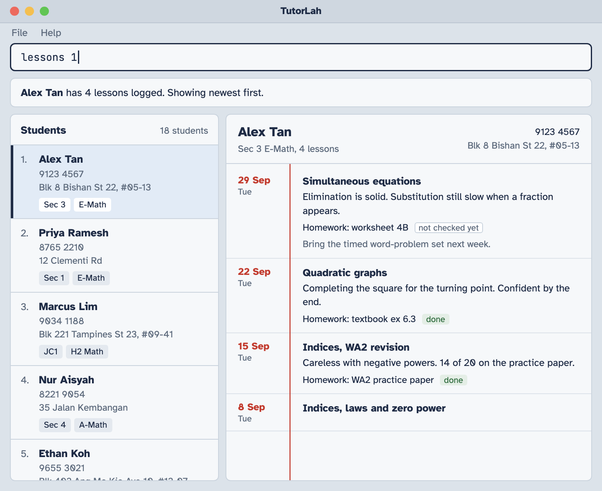

# TutorLah

TutorLah is a desktop application being developed for freelance tutors who prefer typing commands to manage student details and lesson records. It aims to keep student information and notes on completed lessons in one place, making it easier to prepare for the next lesson.

## Planned MVP

* Add a student.
* Delete a student and their associated lesson records.
* List students.
* Add a dated lesson record describing what was covered for a student.
* View a student’s lesson records, with the most recent first.

TutorLah is under active development. These are the proposed MVP capabilities, not a guarantee that every feature is available in the current version. The existing application builds on AB3’s contact-management functionality; lesson-record support is planned.

## Documentation

* [Project website](https://ay2627s1-cs2103t-t11-1.github.io/tp/)
* [User Guide](https://ay2627s1-cs2103t-t11-1.github.io/tp/UserGuide.html)
* [Developer Guide](https://ay2627s1-cs2103t-t11-1.github.io/tp/DeveloperGuide.html)

## Acknowledgements

This project is based on the [AddressBook-Level3](https://github.com/se-edu/addressbook-level3) project created by the [SE-EDU initiative](https://se-education.org).
