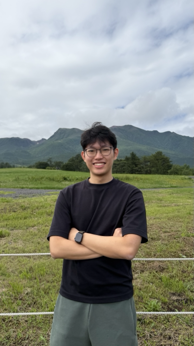
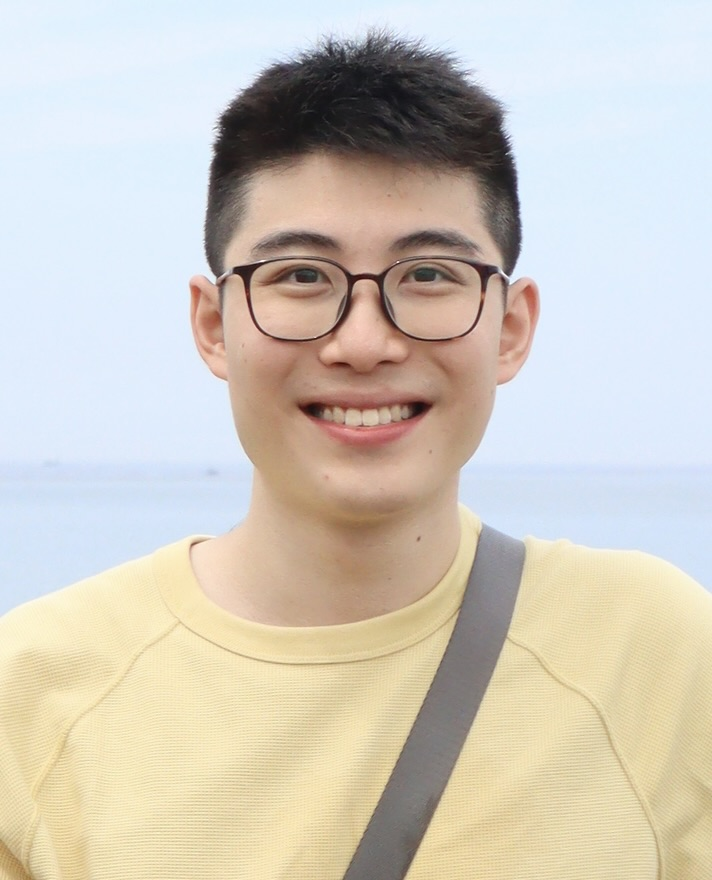

# About Us

We are a team based in the [School of Computing, National University of Singapore](http://www.comp.nus.edu.sg).

You can reach us via zikiai at the email `e1525973@u.nus.edu`

## Project team

### aerodart

[[github](https://github.com/aerodart)]

* Role: Testing, Git Expert
* Responsibilities: Model

### zikiai

[[github](https://github.com/zikiai)]

* Role: Team lead
* Responsibilities: Integration

### fuhlie

[[github](https://github.com/fuhlie)]

* Role: Code quality
* Responsibilities: Logic

### srivatsanj27

[[github](https://github.com/srivatsanj27)]

* Role: Scheduling tracking and deliverables
* Responsibilities: Storage
