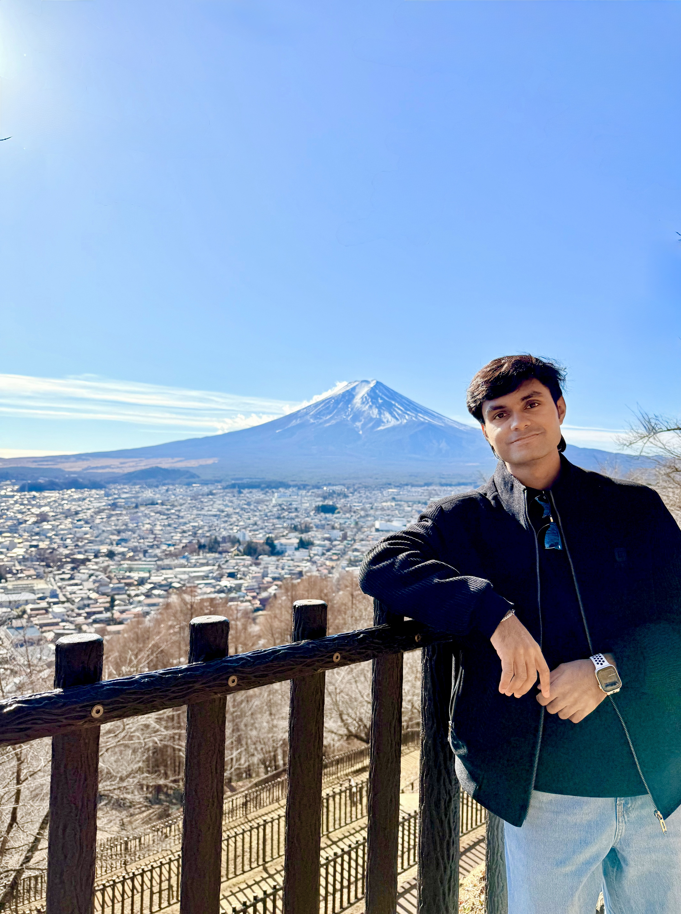

# About Us

We are a team based in the [School of Computing, National University of Singapore](http://www.comp.nus.edu.sg).

You can reach us at the email `seer[at]comp.nus.edu.sg`

## Project team

### John Doe

[[homepage](http://www.comp.nus.edu.sg/~damithch)]
[[github](https://github.com/johndoe)]
[[portfolio](team/johndoe.md)]

* Role: Project Advisor

### Jane Doe

[[github](http://github.com/johndoe)]
[[portfolio](team/johndoe.md)]

* Role: Team Lead
* Responsibilities: UI

### Johnny Doe

[[github](http://github.com/johndoe)] [[portfolio](team/johndoe.md)]

* Role: Developer
* Responsibilities: Data

### Jean Doe

[[github](http://github.com/johndoe)]
[[portfolio](team/johndoe.md)]

* Role: Developer
* Responsibilities: Dev Ops + Threading

### aerodart

[[github](https://github.com/aerodart)]

* Role: Testing, Git Expert
* Responsibilities: Model

### zikiai

[[github](https://github.com/zikiai)]

* Role: Team lead
* Responsibilities: Integration
* Component: None (backup on Logic)

### fuhlie

[[github](https://github.com/fuhlie)]

* Role: Code quality
* Responsibilities: Logic

### cibichandar

[[github](https://github.com/cibichandar)]

* Role: Documentation
* Responsibilities: UI
